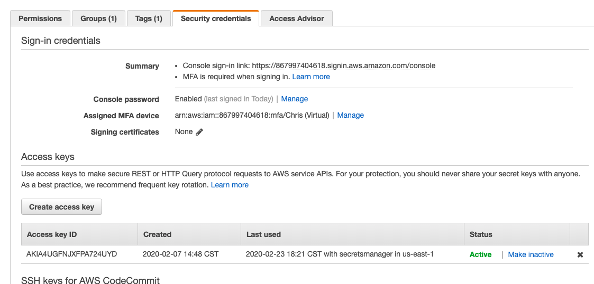
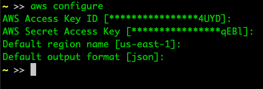

# Installing the AWS CLI

To install the AWS CLI in the easiest way possible, use [HomeBrew](https://brew.sh/)

Once that is installed, we can move on.

## AWS CLI Formula

[Here is the page](https://formulae.brew.sh/formula/awscli) for the formula.

Run 

```sh
#!/bin/sh

brew install awscli
```

Confirm by running 

```sh
#!/bin/sh

aws --version
```

## Configuring to your Profile

Every AWS command needs a set of permissions to be ran. When we set up the IAM user, we made a user with admin permissions, that can do virtually anything on our account. 

Each user is given console access, programmatic access, or both. Here we will need the programmatic access.

On the [IAM console](https://console.aws.amazon.com/iam/home?region=us-east-1#/home), drop down "Access Management" --> "Users"

Click on the user you created, and find the tab "Security Credentials"



## Creating Access Keys

Don't get excited hacker extraordinaire, the access key ID is useless without the secret.

Click on "Create access key" and save the `.csv` to your somewhere safe location. These contain the **Access Key ID** and the **Secret Access Key**

**DO NOOOOOOOOOOTTTTTTTTTT COMMIT THESE KEYS** please. AWS will call you, email you, and block the keys from being used because they can cause you to have to pay a lot of money if someone starts some crazy stuff on your behalf with your keys.

You will never, ever need to use these keys from source control. ***NEEEEEEEVVVVVVEVEEEERRRRRRR**.

Once you have them on the `.csv`, get ready to use them.

## Configuring Your Profile on Your Computer

The AWS CLI will automatically use your keys to execute services on your behalf. It does this by looking for a specific file: `~/.aws/credentials`.

If you're ever curious what's on there, it's your keys, in plain text. These keys are super important, so if you ever lose your computer, disable the keys.

Okay, so the command to setup your profile is 

```sh
#!/bin/sh

aws configure # will be applied to profile "default"

# or optionally, you can add a profile flag for a specific set of keys

aws configure --profile production
```

Running that command will give you a set of inputs like this, only yours will be blank, requiring you to paste the appropriate values:




Leave the region and output format as the screen shot has it.


## Summary

You're ready to do something! Yay! You can now use the AWS CLI to do all kinds of things almost nobody in your family will find interesting or understand..

Too soon?