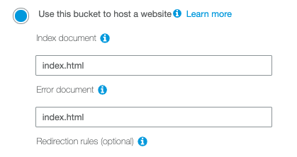

# Setting up the S3 Bucket

Before we can deploy anything, we need to setup the bucket.

Go to the [AWS console for S3](https://s3.console.aws.amazon.com/s3/home?region=us-east-1#). Click on "Create bucket"

## Creating a Bucket

You'll see a popup asking for a bunch of information. 

The first page requires a bucket name. This can be anything you want, as long as it's unique among buckets, and meets AWS naming criteria for DNS compliance.

Next

Next again, nothing here is important at this time.

Next again, we will manage these permissions later

"Create bucket"

Yay! You've created a bucket. Put that on your resume. On second thought, don't.

## Setting Up Hosting

Click on your freshly minted bucket, and then click on the "Properties" tab.

Click on "Static website hosting"

Click "Use this bucket to host a website"

### Index Document



The index document is what is shown when you access the root path. 

Say your url is https://please-hire-me.com. 

The html page you want to show when someone when they go there, would be in the **index document**.

For a Single Page Application ( SPA, such as React, or Vue ) this will be `index.html`.

### Error Document

As the name would suggest, this is the document shown when there is an error such as going to https://please-hire-me.com/page/that/doesnt/exist

You'd have a nice message saying that they've gone nowhere, and to re-evaluate their life.

For a Single Page Application ( SPA, such as React, or Vue ) this will be `index.html` as well. This is because you want S3 to serve index, and let the router of the library to figure out where to send them.

**HEY!**

Look at where it says "Endpoint" and keep that URL. That is where your website will show up.

Click "save" and move on with your life.

## Setting Up Permissions

For now, we're going to host right from the bucket. Later, we wil set up a better way, but for now, bucket it is.

Click on the "Permissions" tab.

You'll see that public access is blocked, which is a problem if we want to host right from the bucket.

Click on "Bucket Policy" and paste the following into the editor.

```json
{
  "Version": "2012-10-17",
  "Statement": [
    {
      "Sid": "Gives read access to static content",
      "Effect": "Allow",
      "Principal": {
          "AWS": "*"
      },
      "Action": "s3:GetObject",
      "Resource": [
          "arn:aws:s3:::YOUR_BUCKET_NAME/*",
          "arn:aws:s3:::YOUR_BUCKET_NAME"
      ]
    }
  ]
}
```

Click "Save".

The above is known as a Policy. [Here's a great write up](https://start.jcolemorrison.com/aws-iam-policies-in-a-nutshell/) about what a Policy is.

TL;DR it tells AWS what we allow on the bucket. We are allowing this bucket to read from itself, to summarize.

## Summary

After that, you're ready to push some code and see the results.
